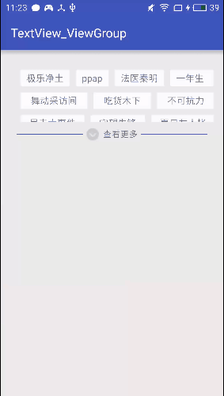

# 自定义热门搜索组件
## 特点：
1. 可以自行添加任意个热门关键词
2. 支持上下滑动来选取热门关键词
3. 占用屏幕空间小
如下示例图：


## 使用方法：
### layout布局文件添加：
```
	<com.jack.textview_viewgroup.view.TextViewGroup
        android:layout_width="match_parent"
        android:layout_height="100dp"
        android:id="@+id/viewgroup"/>
```
高度必须确定好，不能使用wrap_content，因为需要一个默认的初始高度

### java代码添加热门关键字和监听
```java
		viewGroup = (TextViewGroup)findViewById(R.id.viewgroup);
        int index = 0;
        for (String str : list){
            Log.i("jackzhous", "--- " + str);
            TextView textView = new TextView(this);
            textView.setText(str);
            textView.setTextSize(15);

            textView.setBackground(getResources().getDrawable(R.drawable.text_view_bg));
            textView.setTag(str);
            textView.setOnTouchListener(new View.OnTouchListener() {
                @Override
                public boolean onTouch(View v, MotionEvent event) {
                    Toast.makeText(MainActivity.this, "你点击了 " + v.getTag(), Toast.LENGTH_SHORT).show();
                    return false;
                }
            });


            viewGroup.addView(textView, index);
            index++;
        }
```

#### 自定义组件源码为app里面的com.jack.textview_viewgroup.view.TextViewGroup，可以根据自己的需要进行修改